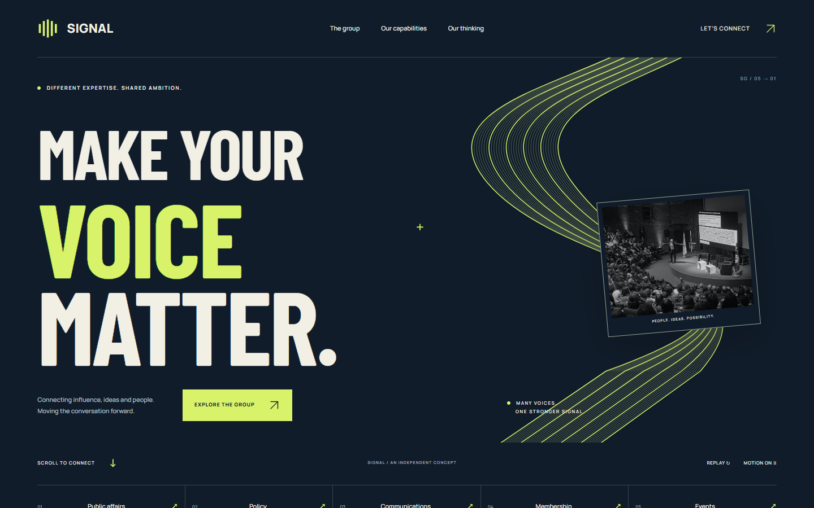
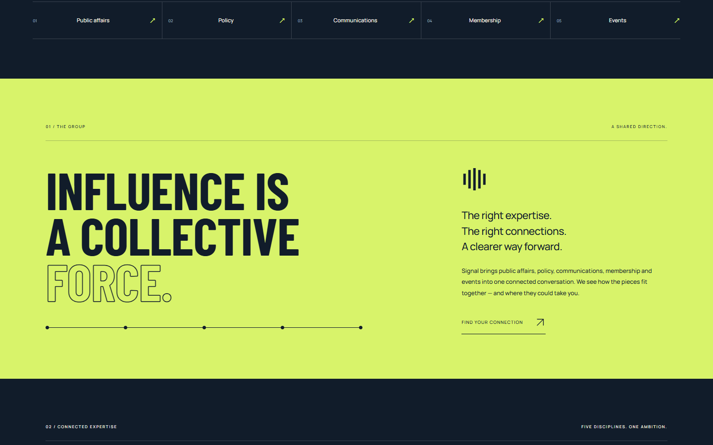
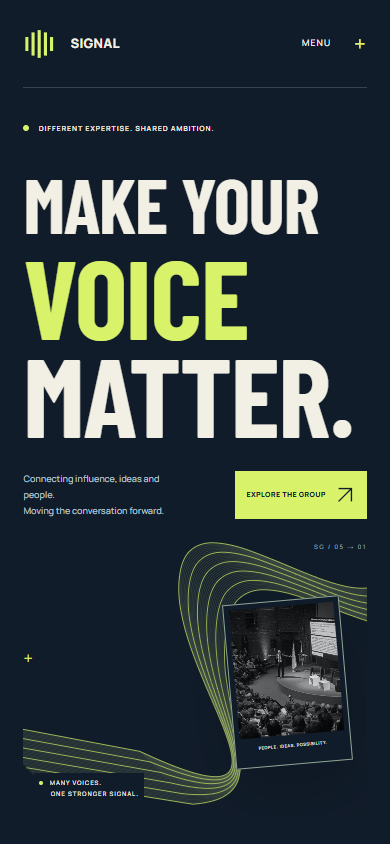
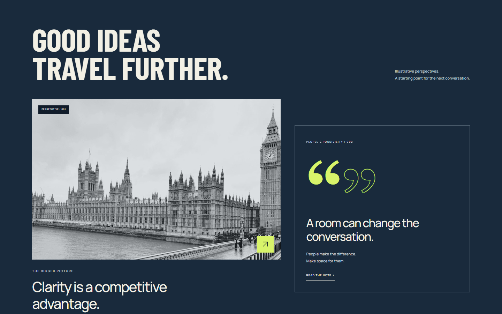

# SIGNAL

**Make your voice matter.** An independent corporate website concept combining kinetic typography, a woven signal graphic and a complete corporate homepage.

[Explore Signal](https://17-signal.williamking.workers.dev) · [Standalone animated hero](https://17-signal.williamking.workers.dev/hero.html) · [Integration guide](HERO-INTEGRATION.md)



## The concept

Five disciplines, one stronger signal. Oversized Barlow Condensed typography resolves alongside travelling SVG lines and a photographic window into a real gathering. Midnight blue, bone and acid lime give the homepage a confident identity, with a bright manifesto section carrying the idea into the rest of the page.

Signal is the second of two deliberately different responses to the same brief. [Common Ground](https://16-common-ground.williamking.workers.dev) takes a warm, editorial approach; Signal uses poster-scale type, technical linework and a sharper colour contrast. Both use fictional brands and original demonstration identities; neither claims commissioned client work or endorsement.

| The shared direction | Designed for phones |
|---|---|
|  |  |

## Explore

- Replay the finite arrival sequence; disable motion or use the system reduced-motion preference.
- Explore all five capabilities. Arrow keys, Home and End move through the selector, with correct selected/focus states.
- Read both editorial notes, then close with Escape and return to your previous control.
- Create a local conversation plan, copy it, or download it as text. No data is submitted.
- Inspect the separate hero as plain HTML/CSS/JavaScript, without loading React.



## Run and integrate

Requires Bun 1.3.10 and Node 24.21.0; versions are pinned in the manifest and lockfile.

```sh
bun install --frozen-lockfile
bun run dev               # loopback :4527
bun run check             # strict types, Biome, production build
bun run preview           # loopback :4627
bun run verify:browser    # separate terminal, installed Google Chrome
bun run deploy            # checks and authenticated Cloudflare upload
node tools/verify-release.mjs https://17-signal.williamking.workers.dev
```

Vite, React, strict TypeScript, GSAP, Tailwind and Lightning CSS. All assets are self-hosted; no video, WebGL, backend, analytics or runtime CDN requests. Static prerendering keeps the complete homepage readable without JavaScript. The separate hero entry excludes React and exposes a cleanup function for host-page integration.

`src/Hero.tsx` contains the identity, typography and original signal paths. `src/motion.ts` owns timeline setup, media queries and cleanup. `src/hero.css` scopes the reusable design to `.sg`. Content is data-driven in `src/content.ts`; homepage interactions live in `src/App.tsx`. [HERO-INTEGRATION.md](HERO-INTEGRATION.md) explains CMS/plain HTML and React delivery, asset paths and brand replacement.

CSS `noDescendingSpecificity` is disabled for component/responsive selectors; other recommended lint rules remain active. A narrow documented accessibility-lint exception keeps the tab panel keyboard reachable. No runtime dependency is shared with another portfolio project.

## Evidence and credits

[Two-concept delivery](docs/DELIVERY.md) · [Design](DESIGN.md) · [Profile](docs/visual/PROJECT_PROFILE.md) · [Verification](docs/VERIFICATION.md) · [Release](docs/RELEASE.md) · [Assets](assets.manifest.json)

The browser review covers six viewports, the five capability states, keyboard focus, dialogs, planner validation/copy/download, motion controls, live preference changes, no-JavaScript content and the standalone hero. Visual review includes sampled arrival states and the complete page sections. This is implementer self-review, not client acceptance, an independent review or physical-phone certification.

Original vector artwork and design by William King. Manrope by the Manrope Project Authors and Barlow Condensed by the Barlow Project Authors, both SIL OFL 1.1; original notices are in `public/fonts/`. Photographs: [Maik Winnecke](https://unsplash.com/photos/the-houses-of-parliament-and-big-ben-in-london-v3nbIVKiETU) and [Marwen Larafa](https://unsplash.com/photos/speaker-presenting-to-a-large-audience-in-an-auditorium-qzO9a6oQ8AM), under the [Unsplash License](https://unsplash.com/license). Images illustrate the sector and do not imply client work or endorsement. The asset manifest records bytes, sources and SHA-256 hashes; `tools/fetch-assets.py` restores exactly those assets.
